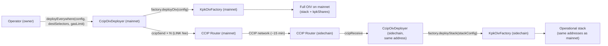
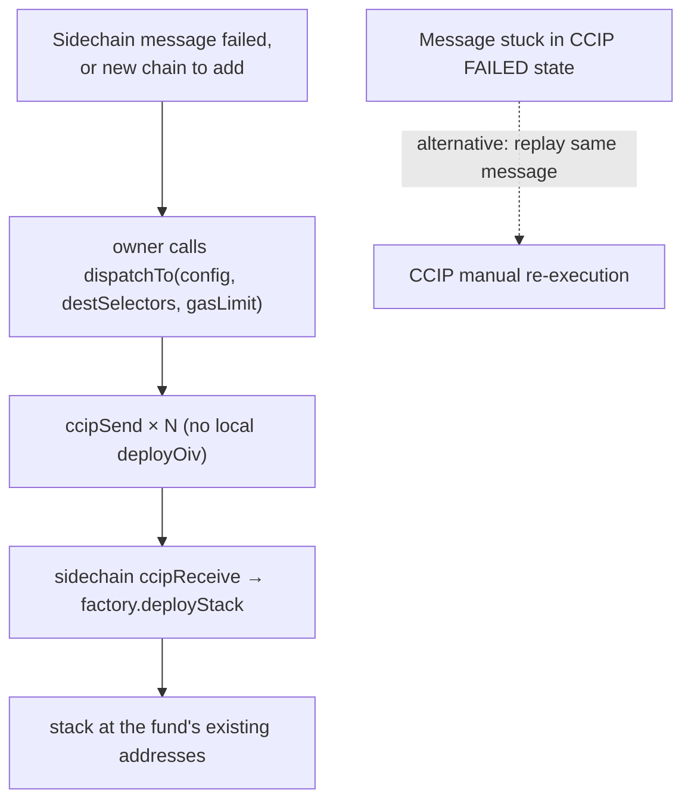

# OIV Fund Deployment Flow (one transaction, multichain via CCIP)

How a **new OIV fund** is deployed to mainnet **and** fanned out to sidechains from a **single
mainnet transaction**, using the already-deployed `CcipOivDeployer`. For the direct per-chain path,
see [FUND_DEPLOYMENT_FLOW.md](FUND_DEPLOYMENT_FLOW.md); for the full design, security model, and
supported-network list, see [CCIP_CROSS_CHAIN_DEPLOY.md](CCIP_CROSS_CHAIN_DEPLOY.md).

> **Assumed already deployed & configured** on every target chain (all at the same address):
> `KpkOivFactory`, `KpkSharesDeployer`, the `Empty` contract, and `CcipOivDeployer` — the latter
> `configure`d with each chain's CCIP router + LINK token and **pre-funded with LINK** on mainnet.
> This doc is only about deploying a **fund** through them.

## End-to-end overview



The orchestrator is the **uniform factory caller** on every chain (same address everywhere), so the
factory sees one identical `msg.sender` and the fund lands at the same Avatar/Manager/Roles
addresses across all chains.

## The one mainnet transaction → asynchronous sidechain delivery

```mermaid
sequenceDiagram
    autonumber
    actor Op as Operator (owner)
    participant O as CcipOivDeployer (mainnet)
    participant F as KpkOivFactory (mainnet)
    participant L as LINK
    participant R as CCIP Router (mainnet)
    participant N as CCIP network
    participant O2 as CcipOivDeployer (sidechain)
    participant F2 as KpkOivFactory (sidechain)

    Op->>O: deployEverywhere(config, destSelectors, gasLimit)
    Note over O: require configured + non-empty destinations
    O->>F: deployOiv(config)
    F-->>O: full OIV deployed on mainnet (emit LocalOivDeployed)
    Note over O: payload = abi.encode(factory.oivToStackConfig(config));<br/>sum getFee over destinations; check LINK balance ≥ total
    O->>L: forceApprove(router, totalFee)
    loop each destination chain
        O->>R: ccipSend(destSelector, message) [receiver = this address]
        R-->>O: messageId (emit StackDispatched)
    end
    O-->>Op: OivInstance + messageIds (tx confirmed)

    Note over R,N: ~15 min — Ethereum finality + CCIP delivery
    N->>O2: ccipReceive(message)
    Note over O2: require msg.sender == router;<br/>sourceChainSelector == mainnet;<br/>decoded sender == address(this)
    O2->>F2: deployStack(stackConfig)
    F2-->>O2: stack deployed at the fund's addresses (emit StackReceived)
```

**Key points**

- The mainnet transaction returns once the messages are **dispatched**; each sidechain stack
  materialises later, after source finality.
- CCIP fees are paid in **LINK from the orchestrator's balance** — size funding up front with
  `quoteDeployEverywhere(config, destSelectors, gasLimit)`. The aggregate fee is checked once and the
  router approved once for the total.
- `ccipReceive` deploys only the **operational stack** (`deployStack`); the `kpkShares` token exists
  on mainnet only.

## Recovery / add-a-chain (`dispatchTo`)

`deployEverywhere` is the first, atomic fan-out and can't be re-run with the same config (its local
`deployOiv` would collide on the mainnet CREATE2 addresses). To extend the fund to a chain that
wasn't in the original set, or to re-send to one whose delivery permanently failed, use
`dispatchTo` — the CCIP fan-out only, no local deploy.



Pass the **same `config`** (notably the same `salt`) so the stack lands at the fund's existing
addresses; never re-dispatch to a chain that already has the stack (its message would revert on the
CREATE2 collision).

## Notes

- **Async, not atomic** — monitor delivery on the [CCIP Explorer](https://ccip.chain.link); a failed
  message enters the FAILED state and is manually re-executable within its retry window.
- **`gasLimit`** must cover `deployStack` on the destination (~1.45M measured; ~1.8M–2.0M
  recommended; CCIP caps destination execution at 3M).
- **`Empty` must be present** on every target chain (the Avatar Safe's sole signer).
- Supported networks, router/LINK/selector values, and the new-chain onboarding checklist are in
  [CCIP_CROSS_CHAIN_DEPLOY.md](CCIP_CROSS_CHAIN_DEPLOY.md) and
  [`../script/ccip-networks.json`](../script/ccip-networks.json).
