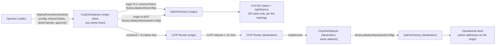
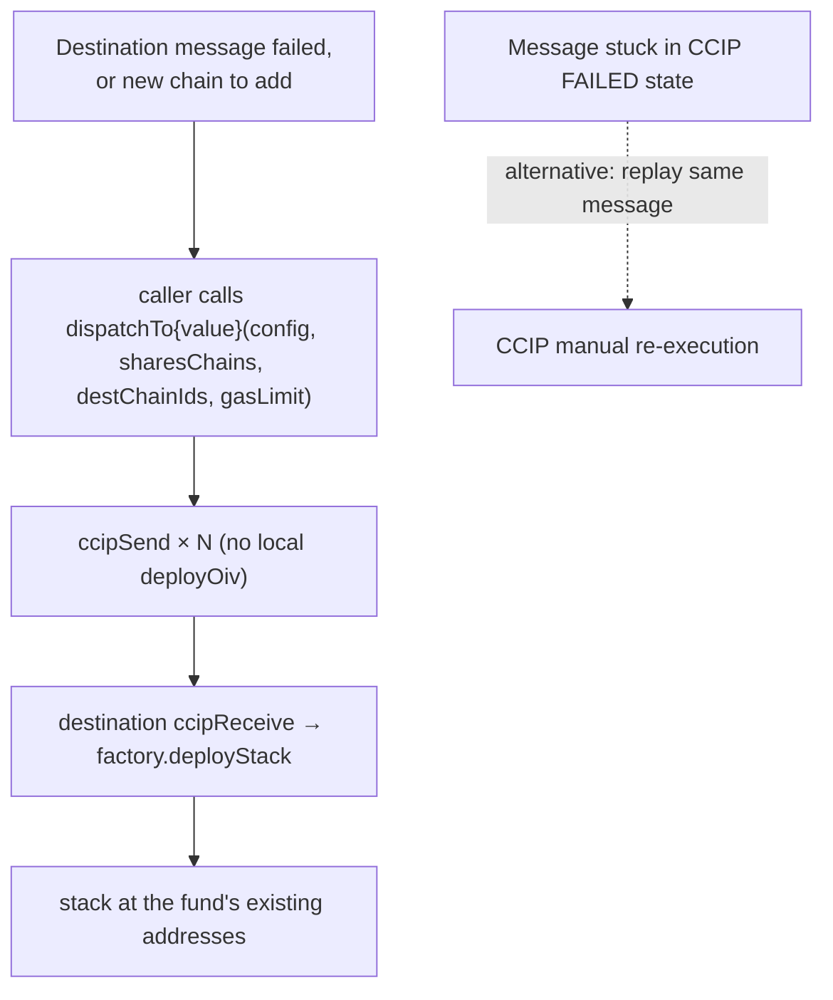

# OIV Fund Deployment Flow (one transaction, multichain via CCIP)

How a **new OIV fund** is deployed on the chain you call from **and** fanned out to every other
chain, from a **single transaction on any wired chain**, using the already-deployed
`CcipOivDeployer`. For the direct per-chain path, see
[FUND_DEPLOYMENT_FLOW.md](FUND_DEPLOYMENT_FLOW.md); for the full design, security model, and
supported-network list, see [CCIP_CROSS_CHAIN_DEPLOY.md](CCIP_CROSS_CHAIN_DEPLOY.md).

> **Assumed already deployed & configured** on every target chain (all at the same address):
> `KpkOivFactory`, the `KpkShares` mastercopy, `KpkTimelockDeployer` and its `TimelockController`
> mastercopy, the `Empty` contract, and `CcipOivDeployer` — the latter `configure`d with each chain's
> CCIP router (the LINK token is optional). There is no designated source chain: the
> `chainId → selector` registry is baked in at construction, and **any wired chain can originate a
> fan-out**. CCIP fees are paid in **native gas by the caller** via `msg.value`, so no LINK
> pre-funding is required. This doc is only about deploying a **fund** through them.

## Two things that are no longer true of the old mainnet-origin flow

If you have read an earlier version of this document, both of these changed:

1. **The origin is whichever wired chain you call from.** `SOURCE_CHAIN_ID` and `NotSourceChain` are
   gone, and `ccipReceive` accepts any selector in the registry — the load-bearing guard is that the
   source sender equals `address(this)`.
2. **Shares are no longer mainnet-only.** A fund declares a `sharesChains` **topology**: every chain
   in it gets the full fund (stack + `kpkShares`), every other wired chain gets the operational stack
   alone. The topology is hashed into the salt, so it must be passed identically everywhere and
   cannot be changed afterwards without moving every address.

## End-to-end overview

```mermaid
flowchart LR
    Op["Operator (caller)"] -->|"deployEverywhere{value}(config, sharesChains, destChainIds, gasLimit)"| Orc["CcipOivDeployer (origin chain,<br/>any wired chain)"]
    Orc -->|"origin IS in sharesChains:<br/>factory.deployOiv(config)"| F["KpkOivFactory (origin)"]
    Orc -->|"origin is NOT:<br/>factory.deployStack(stackConfig)"| F
    F --> Fund["Full OIV (stack + kpkShares)<br/>OR stack only, per the topology"]
    Orc -->|"ccipSend × N (native fee)"| R["CCIP Router (origin)"]
    R -->|"CCIP network (~15 min)"| R2["CCIP Router (destination)"]
    R2 -->|"ccipReceive"| Orc2["CcipOivDeployer (destination,<br/>same address)"]
    Orc2 -->|"factory.deployStack(stackConfig)"| F2["KpkOivFactory (destination)"]
    F2 --> Stack["Operational stack<br/>(same addresses as the origin)"]
```

The orchestrator is the **uniform factory caller** on every chain (same address everywhere), so the
factory sees one identical `msg.sender` and the fund lands at the same Avatar/Manager/Roles
addresses across all chains.

A destination that is itself in `sharesChains` is **excluded from this fan-out** — it is reserved for
its own `deployEverywhere`/`promoteShares` call, because only the chain that carries shares can
deploy them. Sending it a stack would wire that stack and permanently close both routes.

## The one origin transaction → asynchronous destination delivery

```mermaid
sequenceDiagram
    autonumber
    actor Op as Operator (caller)
    participant O as CcipOivDeployer (origin)
    participant F as KpkOivFactory (origin)
    participant R as CCIP Router (origin)
    participant N as CCIP network
    participant O2 as CcipOivDeployer (destination)
    participant F2 as KpkOivFactory (destination)

    Op->>O: deployEverywhere{value}(config, sharesChains, destChainIds, gasLimit)
    Note over O: require onlyWiredChain + non-empty, ascending sharesChains<br/>+ no duplicate destinations
    Note over O: salt = keccak256(config-with-zeroed-asset, sharesChains)<br/>pre-check via factory.predictStackAddresses BEFORE pricing
    Note over O: payload = abi.encode(stackConfig, sharesChainIds),<br/>sum getFee over destinations, require msg.value >= total
    alt origin chain is in sharesChains
        O->>F: deployOiv(config)
        F-->>O: full OIV deployed on the origin (emit LocalOivDeployed)
    else origin carries no shares
        O->>F: deployStack(stackConfig)
        F-->>O: stack only; returned shares fields are zero (emit LocalStackDeployed)
    end
    loop each destination chain (shares chains excluded)
        O->>R: ccipSend{value: fee}(destSelector, message) [receiver = this address]
        R-->>O: messageId (emit StackDispatched)
    end
    O-->>Op: OivInstance + messageIds (surplus refunded, tx confirmed)

    Note over R,N: ~15 min — source finality + CCIP delivery
    N->>O2: ccipReceive(message)
    Note over O2: require msg.sender == router,<br/>sourceChainSelector ∈ registry,<br/>decoded sender == address(this)
    O2->>F2: deployStack(stackConfig)
    F2-->>O2: stack deployed at the fund's addresses (emit StackReceived)
```

**Key points**

- **The local half depends on the topology.** `deployEverywhere` runs `deployOiv` locally only when
  the origin is in `sharesChains`; otherwise it runs `deployStack` and the returned instance's shares
  fields are zero. Starting a fan-out from a stack-only chain is supported and coherent — it just
  does not give that chain a shares token.
- The origin transaction returns once the messages are **dispatched**; each destination stack
  materialises later, after source finality.
- CCIP fees are paid in **native gas from the caller's `msg.value`** — size it up front with
  `quoteDeployEverywhere(config, sharesChains, destChainIds, gasLimit)` (or the no-array
  `quoteDeployEverywhere(config, sharesChains, gasLimit)` for all wired chains, or the single-argument
  `quoteDeployEverywhere(config, gasLimit)` sugar for "this chain carries the shares"). The aggregate
  fee is checked once against `msg.value`, each message pays its own fee in native, and any surplus
  is refunded.
- `ccipReceive` deploys only the **operational stack** (`deployStack`). The `kpkShares` token exists
  on every chain named in `sharesChains` — each deployed by its own transaction on that chain, never
  by CCIP.

## Adding shares to a chain later

Two different situations, and they use different calls — mixing them up is the easy mistake:

**A chain that IS in `sharesChains` but has not deployed yet.** It is filled by the orchestrator's
**`deployLocal(config, sharesChains)`**, run on that chain. This is the call that makes a second
shares chain reachable at all, and the two obvious alternatives are both wrong:

- **not** the factory's raw `deployOiv` — that uses `config.salt` verbatim, while the orchestrator
  derives the salt from the config *and* the topology, so a direct call builds a different fund at
  non-canonical addresses;
- **not** a second `deployEverywhere` — it would work, but re-dispatches stacks to destinations the
  first fan-out already covered, paying every one of those non-refundable fees again;
- **not** `promoteShares` — it reverts `SharesChainAlreadyDeclared` for a chain the topology names.

No other chain's fan-out will send this chain a stack; it is deliberately excluded, because a wired
stack here would take the addresses its own shares deployment needs.

**A chain that is NOT in `sharesChains` at all.** This is what `promoteShares(config, sharesChains)`
is for — the escape hatch for the one thing the salt-bound topology costs, since a fund otherwise
could not gain a shares chain after birth. Call it **on the chain being promoted**, passing the
fund's **original** topology so the salt still resolves to its existing addresses. Preconditions:

- The caller is `config.admin` or the fund's exec timelock. This is the one gated entry point here,
  because a promoted chain's asset is *not* committed to by the topology — an open promotion would
  let anyone holding the config deploy a shares token denominated in a worthless asset at the fund's
  canonical address.
- The operational stack already exists on that chain (`StackNotDeployed` otherwise).
- The Avatar Safe has already approved the shares proxy for **`type(uint256).max`** — on the base
  asset *and* every `additionalAssets` entry with `canRedeem`. Not merely non-zero: a smaller
  allowance would let the fund settle a few redemptions and then start reverting. Promotion cannot
  grant these itself, and the proxy address is predictable beforehand, so approve first.

## Recovery / add-a-chain (`dispatchTo`)

`deployEverywhere` is the first, atomic fan-out and can't be re-run with the same config (its local
`deployOiv` would collide on the origin's CREATE2 addresses). To extend the fund to a chain that
wasn't in the original destination set, or to re-send to one whose delivery permanently failed, use
`dispatchTo(config, sharesChains, destChainIds, gasLimit)` — the CCIP fan-out only, no local deploy.

```mermaid
flowchart TD
    A["Destination message failed,<br/>or new chain to add"] --> B["caller calls dispatchTo{value}(config, sharesChains, destChainIds, gasLimit)"]
    B --> C["ccipSend × N (no local deployOiv)"]
    C --> D["destination ccipReceive → factory.deployStack"]
    D --> E["stack at the fund's existing addresses"]
    A2["Message stuck in CCIP FAILED state"] -.->|"alternative: replay same message"| M["CCIP manual re-execution"]
```

Pass the **same `config` and the same `sharesChains`** (notably the same `salt`) so the stack lands at
the fund's existing addresses; never re-dispatch to a chain that already has the stack (its message
would revert on the CREATE2 collision).

## Notes

- **Async, not atomic** — monitor delivery on the [CCIP Explorer](https://ccip.chain.link); a failed
  message enters the FAILED state and is manually re-executable within its retry window.
- **`gasLimit`** must cover `deployStack` on the destination (~1.55M measured, ~1.86M with an exec timelock; ~2.2M–2.5M
  recommended; CCIP caps destination execution at 3M). The figure rose from ~1.38M when the factory
  began registering MultiSend unwrap adapters (~155k gas), so the older ~1.8M advice is now too
  close to the floor. Under-sizing is not recoverable: the CCIP fee is spent on the source chain and
  the destination `ccipReceive` reverts.
- **`Empty` must be present** on every target chain (the Avatar Safe's sole signer).
- **MultiSend unwrapping must be present** on every target chain — the Zodiac `MultiSendUnwrapper`
  (`0xB4Cd…9efD`) plus both Safe v1.4.1 MultiSend contracts (`0x3886…B526`, `0x9641…02e2`), each with
  its canonical bytecode. `deployStack` reverts `MultiSendUnwrapperMissing` / `MultiSendMissing`
  otherwise. `script/deploy-chain.sh` onboards and then re-verifies these against the chain.
- Supported networks, router/LINK/selector values, and the new-chain onboarding checklist are in
  [CCIP_CROSS_CHAIN_DEPLOY.md](CCIP_CROSS_CHAIN_DEPLOY.md) and
  [`../script/ccip-networks.json`](../script/ccip-networks.json).
