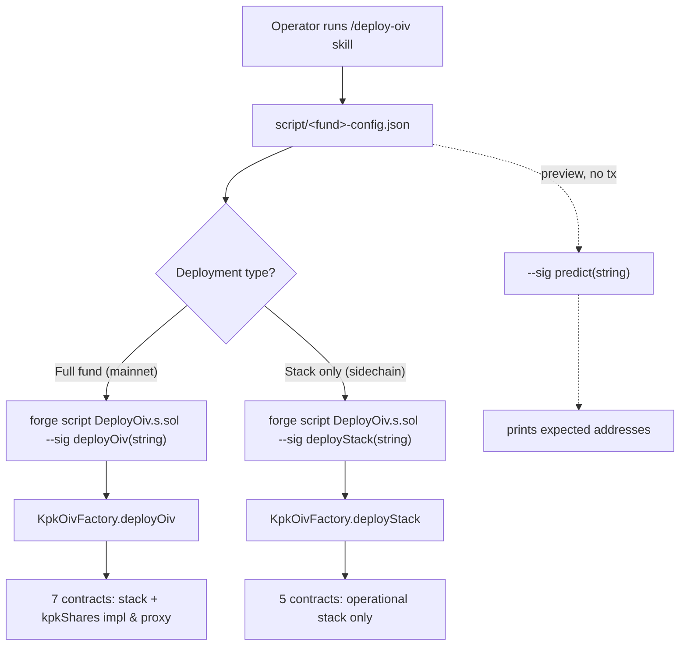
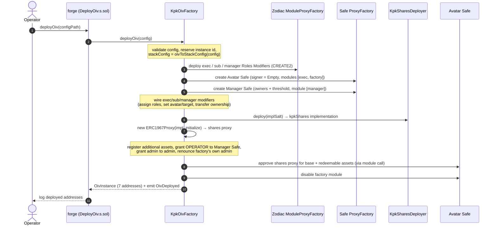
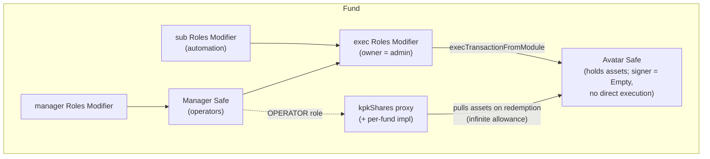
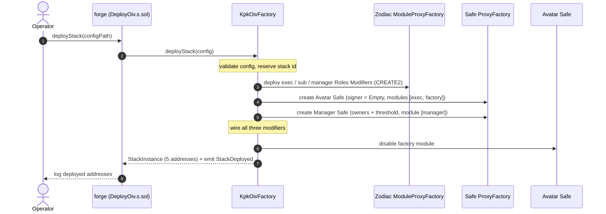

# OIV Fund Deployment Flow (direct, via `KpkOivFactory`)

How a **new OIV fund** is deployed through the already-deployed `KpkOivFactory`. This covers the
direct, per-chain path: `deployOiv` for the full fund (typically mainnet) and `deployStack` for the
operational stack on additional chains. For the one-transaction multichain path, see
[CCIP_FUND_DEPLOYMENT_FLOW.md](CCIP_FUND_DEPLOYMENT_FLOW.md).

> **Assumed already deployed** (same address on every supported chain): `KpkOivFactory`,
> `KpkSharesDeployer`, the `Empty` contract (Avatar Safe signer), and the canonical Safe v1.4.1 +
> Zodiac infrastructure. See [DEPLOYED_ADDRESSES.md](DEPLOYED_ADDRESSES.md). This doc is only about
> deploying a **fund** through them.

## End-to-end overview

The same deployer account (same `msg.sender`) and the same `salt` must be used on every chain — the
factory mixes both into its CREATE2 salts, so this is what makes the fund's Avatar Safe / Manager
Safe / Roles Modifier addresses identical across chains.

## `deployOiv` — full fund (mainnet)

**Result — the deployed fund:**

## `deployStack` — operational stack on a sidechain

Run on each additional chain with the **same deployer and same salt** so the addresses match the
mainnet fund. Identical to `deployOiv` minus the `kpkShares` token.

The five operational-stack addresses are byte-for-byte identical to those `deployOiv` produced on
mainnet for the same `(deployer, salt)`, so the fund shares one Avatar Safe address across all chains.

## Notes

- **Preview first.** `--sig "predict(string)"` calls the factory's view functions and prints the
  expected addresses (including the CREATE2-derived `kpkShares` impl/proxy) without sending a
  transaction.
- **`Empty` must be present** on the target chain, or `deployStack`/`deployOiv` revert with
  `EmptyContractMissing` (the Avatar Safe's sole signer is the `Empty` contract).
- **Deployer holds no privileged role afterwards** — authority is transferred to the configured
  `admin` (exec Roles Modifier owner + shares admin) and the Manager Safe.
- Step-by-step operator instructions and the config format are in [DEPLOYMENT.md](../DEPLOYMENT.md);
  the factory reference is in [KpkOivFactory.md](KpkOivFactory.md).
