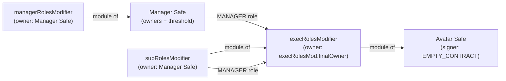
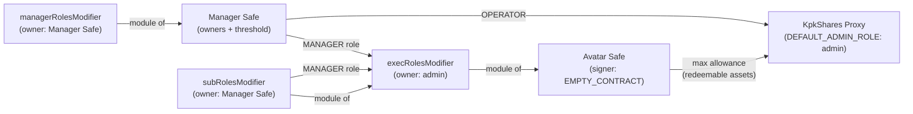
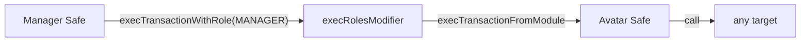
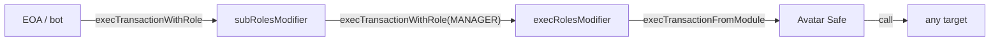

# KpkOivFactory

`KpkOivFactory` deploys KPK fund infrastructure in a single transaction. Both entry points are permissionless and may be called by any account.

Two entry points:

- **`deployStack`** — deploys the five-contract operational stack (two Safes + three Roles Modifiers). Intended for sidechain deployments paired with `deployOiv` on mainnet.
- **`deployOiv`** — deploys the operational stack **and** a `KpkShares` UUPS proxy. Additionally grants infinite asset allowances from the Avatar Safe to the shares proxy and configures additional assets. Typically called on mainnet only.

**Cross-flow address invariant.** For the same `(caller, salt)`, `deployStack` and `deployOiv` produce **identical** Avatar Safe / Manager Safe / Roles Modifier addresses. This is the load-bearing property that lets you call `deployOiv` on mainnet and `deployStack` on every sidechain and end up with a fund whose Avatar Safe has the same address everywhere — so bridges and cross-chain configs can hard-code a single address.

The factory address is mixed into the salt derivation alongside the caller, so cross-chain determinism requires:

1. The factory deployed at the same address on every chain (same constructor args).
2. All infrastructure addresses (`safeProxyFactory`, `safeSingleton`, `safeModuleSetup`, `safeFallbackHandler`, `moduleProxyFactory`, `rolesModifierMastercopy`) the same on every chain.
3. The same `caller` calling the entry point on every chain (caller mixing prevents salt-squat front-running).
4. The same `salt` and the same `managerSafe.owners` / `threshold` across chains (the Manager Safe initializer encodes these too).

### Predict functions

Two read-only helpers return the addresses a deployment would produce, without sending a transaction:

- **`predictStackAddresses(StackConfig, address caller)`** → predicted `StackInstance` (5 addresses).
- **`predictOivAddresses(OivConfig, address caller)`** → predicted `OivInstance`. The five operational-stack addresses match `predictStackAddresses` for the same `(caller, salt)`. `kpkSharesImpl` and `kpkSharesProxy` are returned as `address(0)` because they use plain CREATE (not CREATE2) and depend on deployer nonce, not on the salt.

Use them to look up the address of a fund's Avatar Safe ahead of deployment, e.g. when seeding a governance proposal or pre-configuring a frontend.

---

## How to use

### `deployStack`

Deploys the five-contract operational stack. All five addresses are deterministic — the same `(caller, salt)` on the same factory produces the same addresses on every chain (and matches `deployOiv` for the same inputs — see the cross-flow invariant above).

**Inputs that matter:**

| Field | Description |
|---|---|
| `managerSafe.owners` | Signer addresses of the Manager Safe |
| `managerSafe.threshold` | Required signatures (must be > 0 and ≤ owners.length) |
| `execRolesMod.finalOwner` | Receives ownership of the exec Roles Modifier — typically the Security Council multisig. Must not be zero |
| `salt` | Controls all five deployment addresses |

`subRolesMod.finalOwner` and `managerRolesMod.finalOwner` are ignored — ownership of those modifiers always transfers to the deployed Manager Safe.

**Deployed architecture:**



---

### `deployOiv`

Runs `deployStack` first, then deploys and wires a `KpkShares` UUPS proxy. Typically called on mainnet only.

**Additional inputs beyond `deployStack`:**

| Field | Description |
|---|---|
| `admin` | Receives ownership of the exec Roles Modifier **and** `DEFAULT_ADMIN_ROLE` on the shares proxy. Must not be zero |
| `sharesParams.asset` | Base ERC-20 for subscriptions and redemptions. Must not be zero |
| `sharesParams.name` / `symbol` | ERC-20 name and symbol for the shares token |
| `sharesParams.subscriptionRequestTtl` | Min seconds before an investor can cancel a pending subscription (max 7 days) |
| `sharesParams.redemptionRequestTtl` | Min seconds before an investor can cancel a pending redemption (max 7 days) |
| `sharesParams.feeReceiver` | Receives management fees (minted shares), redemption fees, and performance fees |
| `sharesParams.managementFeeRate` | Annual management fee in basis points (max 2000 = 20%) |
| `sharesParams.redemptionFeeRate` | Per-redemption fee in basis points (max 2000 = 20%) |
| `sharesParams.performanceFeeModule` | Performance fee module address — `address(0)` to disable |
| `sharesParams.performanceFeeRate` | Performance fee in basis points (max 2000 = 20%) |
| `additionalAssets[]` | Extra ERC-20s to enable for deposits or redemptions (pass empty array if none) |

`sharesParams.admin` and `sharesParams.safe` are both **ignored** — overridden by `admin` and the deployed Avatar Safe address respectively.

The following are **wired automatically** and require no input:
- Manager Safe receives `OPERATOR` on the shares proxy
- Avatar Safe is granted unlimited allowance on the shares proxy for every redeemable asset (base asset + any `additionalAssets` with `canRedeem = true`)

**Full deployed architecture:**



---

### Execution flow after deployment

The Avatar Safe cannot execute transactions directly — its sole signer is `EMPTY_CONTRACT`, a contract with no logic. All execution routes through the Roles Modifiers:



The sub Roles Modifier is intended for automations: specific roles with narrow permissions can be granted to EOAs or bots, allowing them to execute on behalf of the Manager Safe. These permissions are always a subset of the MANAGER role policy because every call is still routed through the exec Roles Modifier before reaching the Avatar Safe:



---

## Deployment flow

The factory avoids the `SafeProxyOwner` workaround by deploying the Roles Modifiers first (with itself as temporary owner/avatar/target), embedding the modifier addresses into the Safe `setup()` delegatecall data, and only then fixing up the final configuration.

The factory is **always** included as a setup-time Avatar Safe module in both flows so the Safe `setup()` initializer is byte-identical across `deployStack` and `deployOiv`. The factory is disabled as a module before each entry point returns; in `deployStack` it is never used, in `deployOiv` it routes the token-allowance approvals.

```
1. Deploy execRolesModifier    (factory = owner / avatar / target)
2. Deploy subRolesModifier     (factory = owner / avatar / target)
3. Deploy managerRolesModifier (factory = owner / avatar / target)
4. Deploy Avatar Safe          (EMPTY_CONTRACT as sole signer;
                                execRolesModifier + factory pre-enabled as modules)
5. Deploy Manager Safe         (managerRolesModifier pre-enabled as module)
6. Wire execRolesModifier      → avatar = avatarSafe, target = avatarSafe
                               → assign MANAGER role to managerSafe
                               → enable subRolesModifier as nested module
                               → assign MANAGER role + default role to subRolesModifier
                               → transfer ownership to execRolesMod.finalOwner
7. Wire subRolesModifier       → avatar = avatarSafe, target = execRolesModifier
                               → transfer ownership to managerSafe
8. Wire managerRolesModifier   → avatar = managerSafe, target = managerSafe
                               → transfer ownership to managerSafe

── deployStack: remove factory as module from Avatar Safe and stop ────────

9.  Deploy fresh KpkShares implementation via KpkSharesDeployer (one per fund)
10. Deploy KpkShares UUPS proxy (factory temporarily holds DEFAULT_ADMIN_ROLE)
                               → register additional assets (factory temporarily holds OPERATOR)
                               → grant OPERATOR to sharesOperator
                               → grant DEFAULT_ADMIN_ROLE to admin
                               → factory renounces DEFAULT_ADMIN_ROLE
11. Grant infinite allowance from Avatar Safe to shares proxy for:
                               → base asset (sharesParams.asset)
                               → every additional asset with canRedeem = true
12. Remove factory as module from Avatar Safe

── deployOiv stops here ───────────────────────────────────────────────────
```

### Salt derivation

A single `uint256 salt` in `StackConfig` (or `OivConfig`) controls all five deployment addresses. The factory derives independent per-component values by hashing `(caller, baseSalt, index)`:

| Index | Component              |
|-------|------------------------|
| 0     | `execRolesModifier`    |
| 1     | `subRolesModifier`     |
| 2     | `managerRolesModifier` |
| 3     | Avatar Safe nonce      |
| 4     | Manager Safe nonce     |

`caller` is `msg.sender` of the entry-point call. Mixing it in prevents salt-squat front-running (an observer cannot occupy the deterministic addresses by submitting the same salt with attacker-controlled config). The trade-off: cross-chain determinism requires the same caller to invoke the entry point on every chain.

Providing the same `caller` and `salt` on the same factory (same address, same constructor arguments) on any chain produces identical addresses for all five contracts — and the same Avatar Safe / Manager Safe / Roles Modifier addresses regardless of which entry point (`deployStack` or `deployOiv`) is used.

---

## Factory constructor parameters

Fixed at factory deployment and apply to every stack deployed through it.

| Parameter                  | Description                                              |
|----------------------------|----------------------------------------------------------|
| `owner`                    | Address that controls infrastructure setter functions (does not gate deployment entry points) |
| `safeProxyFactory`         | Gnosis `SafeProxyFactory` — deploys Safe proxies         |
| `safeSingleton`            | Gnosis Safe singleton (implementation)                   |
| `safeModuleSetup`          | Gnosis `SafeModuleSetup` — delegatecalled during `setup()` to pre-enable modules |
| `safeFallbackHandler`      | Safe fallback handler set on every deployed Safe         |
| `moduleProxyFactory`       | Zodiac `ModuleProxyFactory` — deploys Roles Modifier proxies |
| `rolesModifierMastercopy`  | Zodiac Roles Modifier mastercopy all modifiers point to  |
| `kpkSharesDeployer`        | `KpkSharesDeployer` contract — called once per `deployOiv` to produce a fresh, isolated `KpkShares` implementation |

All infrastructure addresses are owner-updatable after deployment via the corresponding `setXxx` setter functions.

---

## `deployStack` input: `StackConfig`

### Avatar Safe

The Avatar Safe is always deployed with the `EMPTY_CONTRACT` (`0xA4703438f8cc4fc2C2503a7e43935Da16BA74652`) as its sole signer. This contract has no logic and is deployed at the same address on every chain via CREATE2, making it impossible to execute transactions directly on the Avatar Safe — all execution must flow through the Roles Modifiers.

There is no `SafeConfig` for the Avatar Safe in `StackConfig`.

### `managerSafe` — `SafeConfig`

The operational Safe used by fund managers.

| Field       | Description                                             |
|-------------|---------------------------------------------------------|
| `owners`    | Signer addresses of the Manager Safe. Must be non-empty |
| `threshold` | Number of signatures required. Must be `> 0` and `<= owners.length` |

### `execRolesMod` — `RolesModifierConfig`

Primary execution layer. Sits in front of the Avatar Safe and enforces role-based transaction permissions.

| Field        | Description                                              |
|--------------|----------------------------------------------------------|
| `finalOwner` | Address that receives ownership after wiring — **must not be zero** (typically the Security Council multisig) |

### `subRolesMod` — `RolesModifierConfig`

Sub-layer Roles Modifier nested inside `execRolesModifier`. Routes calls through the exec layer, allowing finer-grained permission scoping.

| Field        | Description                                              |
|--------------|----------------------------------------------------------|
| `finalOwner` | Ignored — ownership is always transferred to `managerSafe` |

### `managerRolesMod` — `RolesModifierConfig`

Guards actions performed by the Manager Safe itself.

| Field        | Description                                              |
|--------------|----------------------------------------------------------|
| `finalOwner` | Ignored — ownership is always transferred to `managerSafe` |

### `salt` — `uint256`

Single value that determines all five deployment addresses. See [Salt derivation](#salt-derivation) above.

---

## `deployOiv` input: `OivConfig`

`OivConfig` includes the same `managerSafe` and `salt` fields as `StackConfig`, plus the following.

### `admin` — `address`

Single address that receives **both**:
- Ownership of the exec Roles Modifier (equivalent to `execRolesMod.finalOwner` in `deployStack`)
- `DEFAULT_ADMIN_ROLE` on the KpkShares proxy

Must not be zero.

### `sharesParams` — `KpkShares.ConstructorParams`

Initialization parameters for the `KpkShares` UUPS proxy.

| Field                    | Description                                                          |
|--------------------------|----------------------------------------------------------------------|
| `asset`                  | Base ERC20 asset. Registered with deposit and redemption enabled. The Avatar Safe grants infinite allowance to the proxy for this asset |
| `admin`                  | **Ignored** — use the top-level `admin` field instead               |
| `name`                   | ERC20 token name for the shares                                      |
| `symbol`                 | ERC20 token symbol for the shares                                    |
| `safe`                   | **Ignored** — overridden with the deployed `avatarSafe` address     |
| `subscriptionRequestTtl` | Minimum time (seconds) before an investor can cancel a pending subscription. Capped at 7 days |
| `redemptionRequestTtl`   | Minimum time (seconds) before an investor can cancel a pending redemption. Capped at 7 days |
| `feeReceiver`            | Address receiving management fees (minted shares), redemption fees (transferred shares), and performance fees (minted shares) |
| `managementFeeRate`      | Annual management fee in basis points. Max 2000 (20%)                |
| `redemptionFeeRate`      | Per-redemption fee in basis points, deducted from shares before conversion. Max 2000 (20%) |
| `performanceFeeModule`   | Address of the performance fee module. `address(0)` to disable       |
| `performanceFeeRate`     | Performance fee in basis points. Max 2000 (20%)                      |

### `additionalAssets` — `AssetConfig[]`

Optional list of assets to enable on the shares proxy beyond the base asset. The factory temporarily holds `OPERATOR` to register each asset, then revokes it before granting `OPERATOR` to `sharesOperator`.

| Field        | Description                                                         |
|--------------|---------------------------------------------------------------------|
| `asset`      | ERC20 token address. Must not be zero                               |
| `canDeposit` | Whether the asset can be used for subscriptions                     |
| `canRedeem`  | Whether the asset can be used for redemptions. If true, the Avatar Safe also grants infinite allowance to the proxy for this asset |

---

## Post-deployment state

### Avatar Safe

| Property         | Value                                    |
|------------------|------------------------------------------|
| Signers          | `EMPTY_CONTRACT` (sole signer, fixed)    |
| Threshold        | `1`                                      |
| Enabled modules  | `execRolesModifier`                      |
| Fallback handler | `safeFallbackHandler`                    |

### Manager Safe

| Property         | Value                                    |
|------------------|------------------------------------------|
| Signers          | `managerSafe.owners`                     |
| Threshold        | `managerSafe.threshold`                  |
| Enabled modules  | `managerRolesModifier`                   |
| Fallback handler | `safeFallbackHandler`                    |

### Exec Roles Modifier

| Property                               | Value                                    |
|----------------------------------------|------------------------------------------|
| Avatar                                 | `avatarSafe`                             |
| Target                                 | `avatarSafe`                             |
| Owner                                  | `execRolesMod.finalOwner` (deployStack) / `admin` (deployOiv) |
| MANAGER role                           | Assigned to `managerSafe` and `subRolesModifier` |
| Default role of `subRolesModifier`     | `MANAGER`                                |
| Enabled modules                        | `subRolesModifier`                       |

### Sub Roles Modifier

| Property | Value                  |
|----------|------------------------|
| Avatar   | `avatarSafe`           |
| Target   | `execRolesModifier`    |
| Owner    | `managerSafe`          |

Calls routed through `subRolesModifier` are forwarded to `execRolesModifier` (not directly to `avatarSafe`), which applies its own role checks before reaching the Safe.

### Manager Roles Modifier

| Property | Value          |
|----------|----------------|
| Avatar   | `managerSafe`  |
| Target   | `managerSafe`  |
| Owner    | `managerSafe`  |

### KpkShares Proxy (`deployOiv` only)

| Property                    | Value                                                                  |
|-----------------------------|------------------------------------------------------------------------|
| Implementation              | Fresh `KpkShares` instance deployed by `KpkSharesDeployer` (one per fund — upgrades are isolated per fund) |
| `portfolioSafe`             | `avatarSafe`                                                           |
| `DEFAULT_ADMIN_ROLE`        | `admin` (OivConfig.admin)                                              |
| `OPERATOR`                  | `managerSafe` (automatically wired — no separate input required)       |
| Base asset                  | `sharesParams.asset` — deposit + redeem enabled                        |
| Base asset allowance        | `type(uint256).max` from `avatarSafe`                                  |
| Additional assets           | Each entry in `additionalAssets` registered via `updateAsset`; assets with `canRedeem = true` also receive `type(uint256).max` allowance from `avatarSafe` |
| `subscriptionRequestTtl`    | `sharesParams.subscriptionRequestTtl`                                  |
| `redemptionRequestTtl`      | `sharesParams.redemptionRequestTtl`                                    |
| `feeReceiver`               | `sharesParams.feeReceiver`                                             |
| `managementFeeRate`         | `sharesParams.managementFeeRate`                                       |
| `redemptionFeeRate`         | `sharesParams.redemptionFeeRate`                                       |
| `performanceFeeModule`      | `sharesParams.performanceFeeModule`                                    |
| `performanceFeeRate`        | `sharesParams.performanceFeeRate`                                      |

---

## Validation rules

`deployStack` reverts if:

- `managerSafe.owners` is empty (`EmptyOwners`)
- `managerSafe.threshold == 0` or `threshold > owners.length` (`InvalidThreshold`)
- Any `managerSafe.owners[i]` is `address(0)` (`ZeroAddress`)
- `managerSafe.owners` contains a duplicate (`DuplicateOwner`)
- `execRolesMod.finalOwner` is `address(0)` (`ZeroAddress`)
- The chain has no contract deployed at `EMPTY_CONTRACT` (`EmptyContractMissing`)

`deployOiv` reverts if any of the above for its `managerSafe`, plus:

- `admin` is `address(0)` (`ZeroAddress`)
- `sharesParams.asset` is `address(0)` (`ZeroAddress`)
- `sharesParams.feeReceiver`, `sharesParams.subscriptionRequestTtl`, or `sharesParams.redemptionRequestTtl` is unset (`InvalidSharesParams`)
- Any `additionalAssets[i].asset` is `address(0)` (`ZeroAddress`)
- Any `additionalAssets[i].asset` equals `sharesParams.asset`, or two entries share the same asset (`DuplicateAsset`)

`KpkSharesDeployer` is factory-locked (`L-01`): deploy it with `factory = predicted KpkOivFactory address` (e.g. via `vm.computeCreateAddress`), then deploy the factory at the predicted address. Any direct call to `KpkSharesDeployer.deploy()` from a non-factory caller reverts with `UnauthorizedCaller`.

## Trust assumptions

- The factory `owner` controls all infrastructure setters with immediate effect (no in-contract timelock). The owner **MUST** be a `TimelockController` or governance multisig — never an EOA — because a compromised owner can swap `kpkSharesDeployer`, `rolesModifierMastercopy`, or `safeSingleton` to backdoor every future deployment. Past deployments are unaffected (each fund references its own already-deployed implementation).
- For `deployOiv`, the caller controls `config.managerSafe.owners`. The deployed Manager Safe receives ownership of both the sub and manager Roles Modifiers, so `managerSafe.owners` **MUST** be trusted at the same operational level as `config.admin`. The exec Roles Modifier (owned by `admin`) remains the authoritative gatekeeper of Avatar Safe execution, so direct fund drainage requires exec-modifier compromise — but the Manager Safe is **not** a purely operational signer set.
- Both deployment entry points are permissionless. Caller mixing in salt derivation prevents address front-running, but anyone can still spend gas to deploy a fund with arbitrary parameters; consumers of the on-chain registry (`stacks` / `instances`) should not trust an entry without verifying its `admin` and `managerSafe.owners`.
